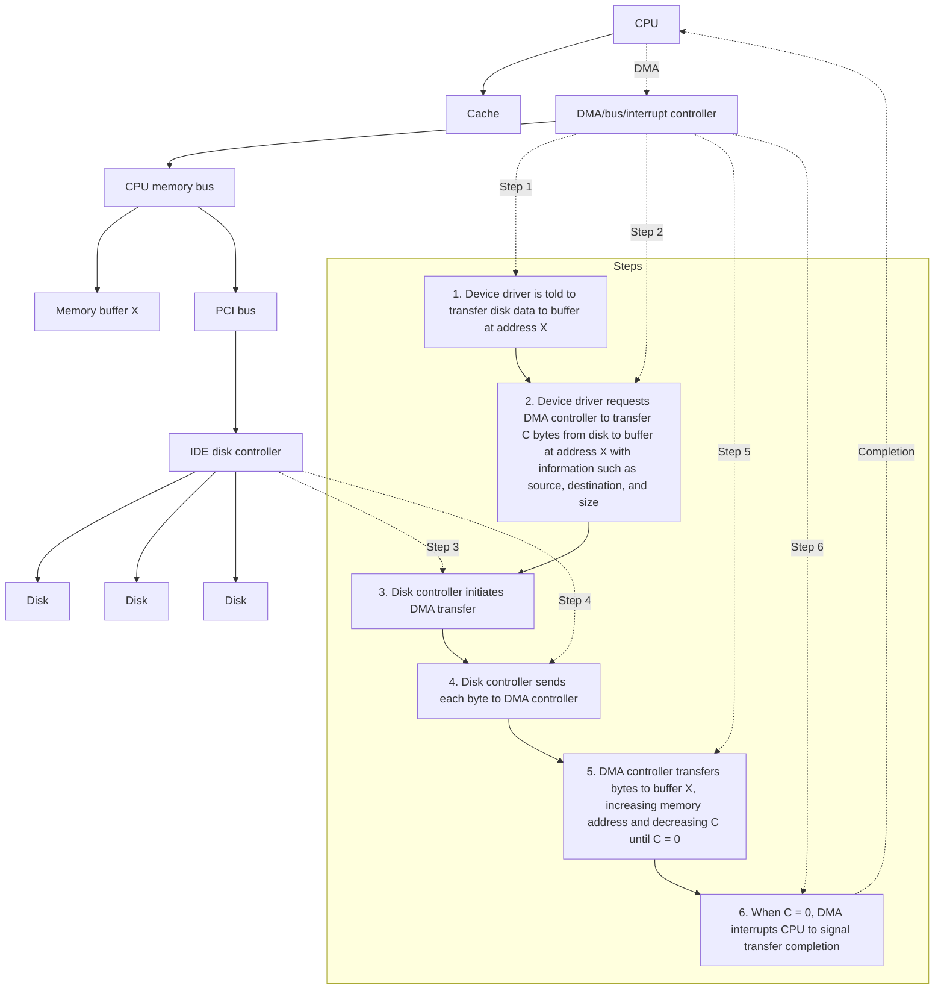

### Operating System Structure - Exercise

1. List the DMA Six Steps and shown as the diagram

1. **CPU Initialization**:

   - **CPU**: The CPU sets up the DMA controller by writing the source address, destination address, transfer direction (read or write), and transfer length (number of bytes) into the DMA controller’s registers.
   - **DMA Controller**: The DMA controller receives this setup information and prepares for the data transfer.
   - **Disk Controller**: The disk controller awaits further commands from the DMA controller or CPU, depending on the nature of the transfer.

2. **Bus Request**:

   - **DMA Controller**: Sends a bus request (BR) signal to the CPU to gain control of the system bus. This indicates that the DMA controller needs to access the bus to perform the data transfer.
   - **CPU**: Upon receiving the bus request, the CPU prepares to relinquish control of the system bus, completing any current bus operations.

3. **Bus Grant**:

   - **CPU**: Acknowledges the DMA controller’s request by sending a bus grant (BG) signal, thereby granting control of the system bus to the DMA controller. The CPU then suspends its operations that require bus access.
   - **DMA Controller**: Takes control of the system bus and prepares to start the data transfer.

4. **Data Transfer**:

   - **DMA Controller**: Manages the data transfer between the I/O device and memory. The controller handles all the bus operations required for the transfer.
     - **Disk Controller**: If the I/O device is a disk, the disk controller sends data to or receives data from the DMA controller based on the operation (read or write).
   - **Memory**: Data is directly transferred between memory and the I/O device. The DMA controller ensures data integrity and handles addressing.
   - **CPU**: The CPU remains idle or continues processing tasks that do not require bus access.

5. **Bus Release**:

   - **DMA Controller**: After completing the data transfer, the DMA controller releases control of the system bus by sending a bus release (BR) signal back to the CPU.
   - **CPU**: Receives the bus release signal and resumes control of the system bus. The CPU can now continue any pending bus operations or start new tasks requiring bus access.

6. **Interrupt**:
   - **DMA Controller**: Sends an interrupt signal to the CPU, indicating the completion of the data transfer.
   - **CPU**: Receives the interrupt, acknowledges the completion of the DMA operation, and processes the data transferred if necessary. The CPU may perform post-transfer operations, such as updating data structures or notifying other system components.

2. Compare the modular kernel approach and layered.

**Modular Kernel Approach:**

- Subsystems interact through carefully constructed, narrow interfaces.
- Minimal exposure of functionality to external modules.
- No strict hierarchy; modules can invoke each other freely.
- Provides greater flexibility in component interaction and communication.
- Requires careful management to maintain system integrity and performance.

**Layered Kernel Approach:**

- Emphasizes defined interfaces.
- Imposes a strict hierarchy: subsystems in lower layers cannot call operations in upper layers.
- Ensures a clear separation of responsibilities and a structured approach.
- Can be less flexible compared to the modular kernel approach.

**Summary:**
The modular kernel approach allows more flexibility with no strict layer restrictions but needs careful management. The layered approach maintains a strict hierarchy, providing clear separation but less flexibility.

3. Which are correct for DMA? a. While the DMA controller is performing the data transfer, the CPU waits for its completion. b. It is used for high-speed I/O devices. c. Only one interrupt is generated per block. d. The DMA controller steals memory cycles from the CPU.

**Answer**:

b., c., d.

**Explanation**:

- **b**: DMA is indeed used for high-speed I/O devices to transfer data directly between memory and devices without CPU intervention.
- **c**: Typically, DMA generates only one interrupt per block of data transfer, reducing the number of interrupts the CPU has to handle.
- **d**: The DMA controller "steals" memory cycles from the CPU to perform data transfers, allowing data movement without continuous CPU involvement.

**Incorrect Statement**:

- **a**: The CPU does not wait for the completion of DMA transfers; it continues executing other tasks until the DMA controller signals completion.

4. Which of the following statements about I/O are correct?
a. For short and frequent I/O, polling I/O can be more efficient than interrupt I/O.
b. Non-blocking I/O can be implemented by block I/O system call with multithread.
c. When an I/O transfer completes, the correct interrupt handler receives the interrupt and moves the user process to the ready queue.
d. Displaying high-performance graphics requires double-buffering and memory-map I/O.

**Answer**:
a., b., d.

**Explanation**:

**a. For short and frequent I/O, polling I/O can be more efficient than interrupt I/O.**

- **Explanation**: Polling I/O involves continuously checking the status of a device to see if it is ready for I/O operations. For short and frequent I/O operations, the overhead of handling interrupts (context switching, saving and restoring states) can be higher than the cost of simply checking the device status. Thus, polling can be more efficient in such cases.
  - **Correct**: Yes

**b. Non-blocking I/O can be implemented by blocking I/O system call with multithread.**

- **Explanation**: Non-blocking I/O allows a process to initiate an I/O operation and continue executing without waiting for the operation to complete. By using multithreading, one thread can perform the blocking I/O operation while another thread continues executing, effectively achieving non-blocking behavior.
  - **Correct**: Yes

**c. When an I/O transfer completes, the correct interrupt handler receives the interrupt and moves the user process to the ready queue.**

- **Explanation**: When an I/O transfer completes, the interrupt handler does receive the interrupt and typically performs some processing related to the completed I/O. However, moving the user process to the ready queue is not necessarily part of the interrupt handler's responsibilities. This action is generally managed by the scheduler or the kernel's I/O subsystem.
  - **Correct**: No

**d. Displaying high-performance graphics requires double-buffering and memory-map I/O.**

- **Explanation**: High-performance graphics rendering often uses double-buffering to minimize flickering and tearing. Double-buffering involves using two buffers: one for display and one for drawing. Memory-mapped I/O allows the CPU to access device memory directly as if it were part of the main memory, which is essential for the efficient handling of large amounts of graphical data.
  - **Correct**: Yes

5. What is the difference between a trap and a hardware interrupt?

**Answer**:

- **Trap**: A trap is a software-generated interrupt caused by exceptional conditions (e.g., divide by zero) within the CPU or by specific instructions in the program (e.g., request the services provided by the OS).
- **Hardware Interrupt**: A hardware interrupt is generated by external hardware devices to signal events that require attention from the CPU (e.g., I/O completion, timer expiration).

6. The process synchronization problem is a major research problem for modern Operating System. Assume that a computer does not have hardware interrupt, do you think the process synchronization problem no longer exists for such a computer?

**Answer**:

The process synchronization problem still exists. The absence of hardware interrupts does not eliminate other sources of interrupts like traps. If processes access shared resources and fatal errors occur, race conditions and synchronization issues will still need to be addressed.

7. For a computer with no hardware interrupt, is it possible to implement a multi-tasking Operating System?

**Answer**:

Yes, it is possible. The OS can set up a logical timer and check the timer periodically to switch between tasks (processes). This approach, known as polling, is less efficient than hardware interrupts but can still enable multitasking (time-sharing systems).

8. Which are correct for operating system structure and operations?
a. One of the most important aspects of operating systems is the ability to multiprogram.
b. Time sharing is a logical extension of multiprogramming.
c. A trap is a hardware-generated interrupt caused by an error.
d. A timer could be used to prevent user programs from getting stuck in an infinite loop and never returning control to the operating system.

**Answer**:

a., b., d.

- c. no, a trap is a software-generated interrupt caused by an error or OS request.

9. Which of the following statement is correct?
a. For interrupt which is masked, the interrupt still notifies the CPU but the CPU does not process the request.
b. The overall system performance can be always improved by enabling DMA.
c. The DMA mechanism is usually suitable for a character device.
d. Software interrupt also goes through the interrupt controller to notify the CPU.

**Answer**:
a.

**Explanation**:

- **a. For interrupt which is masked, the interrupt still notifies the CPU but the CPU does not process the request.**

  - **Correct**: Masked interrupts are acknowledged by the CPU but not processed immediately; they are typically held pending until unmasked.

- **b. The overall system performance can be always improved by enabling DMA.**

  - **Incorrect**: While DMA can improve performance by offloading data transfer tasks from the CPU, it is not always beneficial for all types of data transfers or system configurations.

- **c. The DMA mechanism is usually suitable for a character device.**

  - **Incorrect**: DMA is typically used for block devices that transfer large amounts of data, not character devices which usually handle smaller, more frequent transfers.

- **d. Software interrupt also goes through the interrupt controller to notify the CPU.**
  - **Incorrect**: Software interrupts are directly handled by the CPU and the operating system's interrupt handling mechanism, without involving the interrupt controller in the traditional sense.

10. What is Dual-Mode Operation and what is the primary purpose?

**Answer**:

Dual-mode operation in computer systems ensures secure and efficient functioning by distinguishing between **kernel mode** and **user mode**. **Kernel mode** (or monitor mode) allows the operating system to execute privileged instructions and manage hardware resources directly. **User mode** restricts applications from accessing hardware directly, preventing misuse of CPU, memory, and I/O devices. This separation enhances **hardware resource protection**, balanced resource allocation, and overall system stability. Key mechanisms include **system calls** for user requests, **interrupt service routines (ISRs)** for handling hardware interrupts, and **schedulers** and **dispatchers** for managing process execution and transitions efficiently.

