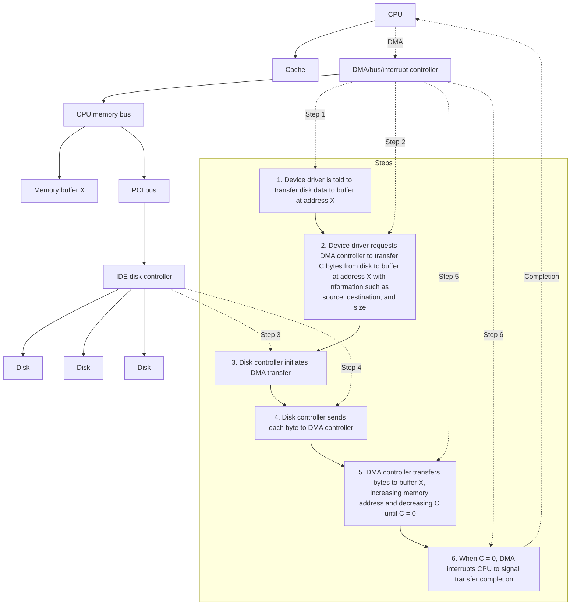

### Operating System Structure - Exercise

1. List the DMA Six Steps and shown as the diagram

1. **CPU Initialization**:

   - **CPU**: The CPU sets up the DMA controller by writing the source address, destination address, transfer direction (read or write), and transfer length (number of bytes) into the DMA controller’s registers.
   - **DMA Controller**: The DMA controller receives this setup information and prepares for the data transfer.
   - **Disk Controller**: The disk controller awaits further commands from the DMA controller or CPU, depending on the nature of the transfer.

2. **Bus Request**:

   - **DMA Controller**: Sends a bus request (BR) signal to the CPU to gain control of the system bus. This indicates that the DMA controller needs to access the bus to perform the data transfer.
   - **CPU**: Upon receiving the bus request, the CPU prepares to relinquish control of the system bus, completing any current bus operations.

3. **Bus Grant**:

   - **CPU**: Acknowledges the DMA controller’s request by sending a bus grant (BG) signal, thereby granting control of the system bus to the DMA controller. The CPU then suspends its operations that require bus access.
   - **DMA Controller**: Takes control of the system bus and prepares to start the data transfer.

4. **Data Transfer**:

   - **DMA Controller**: Manages the data transfer between the I/O device and memory. The controller handles all the bus operations required for the transfer.
     - **Disk Controller**: If the I/O device is a disk, the disk controller sends data to or receives data from the DMA controller based on the operation (read or write).
   - **Memory**: Data is directly transferred between memory and the I/O device. The DMA controller ensures data integrity and handles addressing.
   - **CPU**: The CPU remains idle or continues processing tasks that do not require bus access.

5. **Bus Release**:

   - **DMA Controller**: After completing the data transfer, the DMA controller releases control of the system bus by sending a bus release (BR) signal back to the CPU.
   - **CPU**: Receives the bus release signal and resumes control of the system bus. The CPU can now continue any pending bus operations or start new tasks requiring bus access.

6. **Interrupt**:
   - **DMA Controller**: Sends an interrupt signal to the CPU, indicating the completion of the data transfer.
   - **CPU**: Receives the interrupt, acknowledges the completion of the DMA operation, and processes the data transferred if necessary. The CPU may perform post-transfer operations, such as updating data structures or notifying other system components.

2. Compare the modular kernel approach and layered.

**Modular Kernel Approach:**

- Subsystems interact through carefully constructed, narrow interfaces.
- Minimal exposure of functionality to external modules.
- No strict hierarchy; modules can invoke each other freely.
- Provides greater flexibility in component interaction and communication.
- Requires careful management to maintain system integrity and performance.

**Layered Kernel Approach:**

- Emphasizes defined interfaces.
- Imposes a strict hierarchy: subsystems in lower layers cannot call operations in upper layers.
- Ensures a clear separation of responsibilities and a structured approach.
- Can be less flexible compared to the modular kernel approach.

**Summary:**
The modular kernel approach allows more flexibility with no strict layer restrictions but needs careful management. The layered approach maintains a strict hierarchy, providing clear separation but less flexibility.

3. Which are correct for DMA? a. While the DMA controller is performing the data transfer, the CPU waits for its completion. b. It is used for high-speed I/O devices. c. Only one interrupt is generated per block. d. The DMA controller steals memory cycles from the CPU.

**Answer**:

b, c, d.

**Explanation**:

- **b**: DMA is indeed used for high-speed I/O devices to transfer data directly between memory and devices without CPU intervention.
- **c**: Typically, DMA generates only one interrupt per block of data transfer, reducing the number of interrupts the CPU has to handle.
- **d**: The DMA controller "steals" memory cycles from the CPU to perform data transfers, allowing data movement without continuous CPU involvement.

**Incorrect Statement**:

- **a**: The CPU does not wait for the completion of DMA transfers; it continues executing other tasks until the DMA controller signals completion.

4. Which of the following statements about I/O are correct?
a. For short and frequent I/O, polling I/O can be more efficient than interrupt I/O.
b. Non-blocking I/O can be implemented by block I/O system call with multithread.
c. When an I/O transfer completes, the correct interrupt handler receives the interrupt and moves the user process to the ready queue.
d. Displaying high-performance graphics requires double-buffering and memory-map I/O.

**Answer**:
a, b, d.

**Explanation**:

**a. For short and frequent I/O, polling I/O can be more efficient than interrupt I/O.**

- **Explanation**: Polling I/O involves continuously checking the status of a device to see if it is ready for I/O operations. For short and frequent I/O operations, the overhead of handling interrupts (context switching, saving and restoring states) can be higher than the cost of simply checking the device status. Thus, polling can be more efficient in such cases.
  - **Correct**: Yes

**b. Non-blocking I/O can be implemented by blocking I/O system call with multithread.**

- **Explanation**: Non-blocking I/O allows a process to initiate an I/O operation and continue executing without waiting for the operation to complete. By using multithreading, one thread can perform the blocking I/O operation while another thread continues executing, effectively achieving non-blocking behavior.
  - **Correct**: Yes

**c. When an I/O transfer completes, the correct interrupt handler receives the interrupt and moves the user process to the ready queue.**

- **Explanation**: When an I/O transfer completes, the interrupt handler does receive the interrupt and typically performs some processing related to the completed I/O. However, moving the user process to the ready queue is not necessarily part of the interrupt handler's responsibilities. This action is generally managed by the scheduler or the kernel's I/O subsystem.
  - **Correct**: No

**d. Displaying high-performance graphics requires double-buffering and memory-map I/O.**

- **Explanation**: High-performance graphics rendering often uses double-buffering to minimize flickering and tearing. Double-buffering involves using two buffers: one for display and one for drawing. Memory-mapped I/O allows the CPU to access device memory directly as if it were part of the main memory, which is essential for the efficient handling of large amounts of graphical data.
  - **Correct**: Yes

5. What is the difference between a trap and a hardware interrupt?

**Answer**:

- **Trap**: A trap is a software-generated interrupt caused by exceptional conditions (e.g., divide by zero) within the CPU or by specific instructions in the program (e.g., request the services provided by the OS).
- **Hardware Interrupt**: A hardware interrupt is generated by external hardware devices to signal events that require attention from the CPU (e.g., I/O completion, timer expiration).

6. The process synchronization problem is a major research problem for modern Operating System. Assume that a computer does not have hardware interrupt, do you think the process synchronization problem no longer exists for such a computer?

**Answer**:

The process synchronization problem still exists. The absence of hardware interrupts does not eliminate other sources of interrupts like traps. If processes access shared resources and fatal errors occur, race conditions and synchronization issues will still need to be addressed.

7. For a computer with no hardware interrupt, is it possible to implement a multi-tasking Operating System?

**Answer**:

Yes, it is possible. The OS can set up a logical timer and check the timer periodically to switch between tasks (processes). This approach, known as polling, is less efficient than hardware interrupts but can still enable multitasking (time-sharing systems).

8. Which are correct for operating system structure and operations?
a. One of the most important aspects of operating systems is the ability to multiprogram.
b. Time sharing is a logical extension of multiprogramming.
c. A trap is a hardware-generated interrupt caused by an error.
d. A timer could be used to prevent user programs from getting stuck in an infinite loop and never returning control to the operating system.

**Answer**:

a, b, d.

- c. no, a trap is a software-generated interrupt caused by an error or OS request.

9. Which of the following statement is correct?
a. For interrupt which is masked, the interrupt still notifies the CPU but the CPU does not process the request.
b. The overall system performance can be always improved by enabling DMA.
c. The DMA mechanism is usually suitable for a character device.
d. Software interrupt also goes through the interrupt controller to notify the CPU.

**Answer**:
a.

**Explanation**:

- **a. For interrupt which is masked, the interrupt still notifies the CPU but the CPU does not process the request.**

  - **Correct**: Masked interrupts are acknowledged by the CPU but not processed immediately; they are typically held pending until unmasked.

- **b. The overall system performance can be always improved by enabling DMA.**

  - **Incorrect**: While DMA can improve performance by offloading data transfer tasks from the CPU, it is not always beneficial for all types of data transfers or system configurations.

- **c. The DMA mechanism is usually suitable for a character device.**

  - **Incorrect**: DMA is typically used for block devices that transfer large amounts of data, not character devices which usually handle smaller, more frequent transfers.

- **d. Software interrupt also goes through the interrupt controller to notify the CPU.**
  - **Incorrect**: Software interrupts are directly handled by the CPU and the operating system's interrupt handling mechanism, without involving the interrupt controller in the traditional sense.

10. What is Dual-Mode Operation and what is the primary purpose?

**Answer**:

Dual-mode operation in computer systems ensures secure and efficient functioning by distinguishing between **kernel mode** and **user mode**. **Kernel mode** (or monitor mode) allows the operating system to execute privileged instructions and manage hardware resources directly. **User mode** restricts applications from accessing hardware directly, preventing misuse of CPU, memory, and I/O devices. This separation enhances **hardware resource protection**, balanced resource allocation, and overall system stability. Key mechanisms include **system calls** for user requests, **interrupt service routines (ISRs)** for handling hardware interrupts, and **schedulers** and **dispatchers** for managing process execution and transitions efficiently.

11. Which are correct for operating system structure?
a. In MS-DOS, application programs are able to access the basic I/O routines to write directly to the display and disk drivers.
b. The early UNIX system modularized the kernel using the microkernel approach.
c. Layered approach used in the operating system structure simplifies debugging and system verification.
d. Solaris is organized around a core kernel with several types of loadable kernel modules.

**Answer**:

a. In MS-DOS, application programs are able to access the basic I/O routines to write directly to the display and disk drivers.  
c. Layered approach used in the operating system structure simplifies debugging and system verification.  
d. Solaris is organized around a core kernel with several types of loadable kernel modules.

**Explanation**:

- **a**: MS-DOS allows applications to directly access system hardware, which is one of the reasons for its lack of security and protection.
- **c**: The layered approach indeed simplifies debugging and system verification by enforcing a hierarchical structure.
- **d**: Solaris uses a modular approach with a core kernel and various loadable kernel modules for flexibility and extensibility.

**Incorrect Statement**:

- **b**: The early UNIX system did not use the microkernel approach; it used a monolithic kernel where all operating system services ran in the kernel space.

12. Which of the following are correct statements about kernel I/O subsystems?
a. A program using asynchronous I/O system calls is simpler to write than using synchronous I/O system calls.
b. When an I/O request is finished, the I/O device will issue an interrupt to the user-level process that issues the I/O request telling it that the request has been served.
c. In UNIX, a file descriptor created in a user-level process may refer to a file or a network socket.
d. When a user-level process calls a write() system call with the address of the buffer containing the data, the kernel copies the data from the user-level buffer directly to the hardware buffer of the I/O device for efficiency.
e. Buffer can be used to cope with a speed mismatch between the producer and consumer of a data stream.

**Answer**:

c. In UNIX, a file descriptor created in a user-level process may refer to a file or a network socket.  
e. Buffer can be used to cope with a speed mismatch between the producer and consumer of a data stream.

**Explanation**:

- **c**: In UNIX, file descriptors are a common abstraction for files, pipes, and network sockets, making them versatile for I/O operations.
- **e**: Buffers are commonly used to handle differences in the speed of data production and consumption, helping to ensure smooth data transfer.

**Incorrect Statements**:

- **a**: Asynchronous I/O calls are generally more complex to write than synchronous I/O calls because they require managing the I/O operation's completion separately.
- **b**: When an I/O request is finished, the I/O device issues an interrupt to the kernel, not directly to the user-level process. The kernel then handles the interrupt and informs the user-level process.
- **d**: The kernel does not always copy data directly from the user-level buffer to the hardware buffer. Instead, it often uses an intermediate buffer within the kernel to manage the data transfer efficiently and securely.

13. Compare DMA (Direct Memory Access) and Interrupt-Driven I/O, what are the advantages of DMA and at what cost?

**Answer**:

DMA (Direct Memory Access) is more efficient than interrupt-driven I/O for high-volume data transfers and low interrupt frequency, as it allows direct data transfer between I/O devices and memory without continuous CPU involvement, freeing the CPU for other tasks and reducing overhead. However, DMA adds complexity to hardware design, as it requires interleaving (cycle stealing) to manage memory and bus control, causing the CPU to wait during DMA operations. This is ideal for large data transfers but less so for simpler tasks where the overhead of setting up DMA is not justified.

14. Which of the following operations are usually not involved when an interrupt occurs?
a. Program counter is saved.
b. New program counter is loaded from interrupt service table.
c. Registers saved and new stack set up.
d. Service process executed.
e. All of the above.

**Answer**: e. All of the above.

**Explanation**: When an interrupt occurs, the CPU performs several critical operations to handle the event while preserving the current program's state (context). First, the current program counter (PC) is saved, usually onto a system stack, to ensure the CPU can return to the interrupted task later. Next, the CPU loads a new PC value from the interrupt vector table, which points to the interrupt service routine (ISR) that will handle the interrupt. The CPU then saves all current registers and possibly sets up a new stack for the ISR. The ISR executes, performing the necessary tasks to address the interrupt, such as reading data from an I/O device or processing an event. After the ISR completes, the CPU restores the saved registers and the PC, allowing the interrupted program to resume from where it left off. This sequence ensures that interrupts are handled efficiently without losing the execution context of the running program.

- program counter (PC): A register in the CPU that stores the address of the next instruction to be executed.
- interrupt service table: A data structure that maps interrupt numbers to the corresponding interrupt service routines (ISRs). Also known as the interrupt vector table.
- registers: CPU registers store data and control information used during program execution.
- stack: A data structure used to store function call information, local variables, and other data during program execution in a LIFO (Last In, First Out) manner in memory.

15. `getpid()` is a system call that user can use to get the process ID of the current process. Please explain how `getpid()` works in steps, starting from user C program to OS return the process ID.

**Answer**:
When a user calls the `getpid()` function in a C program, the process begins with the user code making a system call to the operating system (OS). This involves a **software interrupt** or **trap** that switches the CPU from **user mode** to **kernel mode**. In kernel mode, the OS retrieves the **process ID (PID)** from the **process control block (PCB)** of the current process by checking the **trap ID** and **parameters** of the system call. The PID is then returned to the user program. The OS ensures that the **context is saved and restored correctly** so that the user program can resume execution seamlessly after the system call is handled, providing the process ID back to the user space.

16. Which is not the main advantage of multiprocessor systems?
a. Increased throughput.
b. Increased reliability.
c. Economy of scale.
d. high CPU utilization.

**Answer**:
The correct answer is **d. high CPU utilization**.

While multiprocessor systems increase throughput, reliability, and offer an economy of scale, they focus on balancing the load across multiple processors rather than maximizing CPU utilization.

17. What is the structure of Solaris?
a. Monolithic structure.
b. Microkernel.
c. Layered approach.
d. Modules.

**Answer**:
The correct answer is **d. Modules**.

Solaris is organized around a core kernel with several types of loadable kernel modules, allowing for flexibility and extensibility in the operating system's design.

18. Explain the following terms:

1. **Dual-Mode Operation**: Systems operate in at least two modes: supervisor mode (kernel mode) and user mode.

   - **Kernel mode**: OS has control, executes system calls and critical instructions.
   - **User mode**: Runs user processes, restricted from executing critical instructions.

2. **Privileged Instructions**: Special instructions that can only be executed in kernel mode to prevent user programs from performing potentially harmful operations.

3. **Software Interrupt**: An interrupt triggered by a software instruction, usually to request a service from the operating system.

4. **System Call**: Mechanism for user programs to interact with the operating system to request services like process control, file manipulation, and device handling.

5. **Process Control Block (PCB)**: A data structure in the operating system that contains information about a specific process, such as process ID, program counter, CPU registers, memory management info, and I/O status.

19. What is the relationship between a guest operating system and a host operating system in systems like VMware? Also, what factors need to be considered in choosing the host operating system?

**Answer**:

In systems like VMware, the guest operating system (OS) operates within a virtual machine and provides its services by mapping them onto the functionality of the host OS, which runs the virtualization software. The key issue is that the host OS must be sufficiently general in terms of its system call interface to support the functionalities of the guest OS. When choosing a host OS, factors such as hardware compatibility, stability, performance, security, and support for virtualization features are crucial. The host OS must efficiently manage resources and provide robust support for the virtualization platform to ensure optimal performance and reliability for the guest OS.

20. Which presents the guest with a system that is similar but not identical to the guest's preferred system so the guest usually need be modified to run on it?
a. Para-virtualization.
b. Simulation.
c. Java Virtual Machine.
d. .NET Framework.

**Answer**: a. Para-virtualization.

**Explanation**: Para-virtualization provides a modified version of the hardware interface to the guest OS, making it similar but not identical to its preferred environment. This often requires changes to the guest OS to optimize performance and compatibility. For example, Xen is a hypervisor that uses para-virtualization, where guest OSes need to be modified to run efficiently on Xen's para-virtualized environment.

21. Java is a popular object-oriented programming language introduced by Sun Microsystems. The ______ is a specification provided by Java for an abstract computer. It consists of ______ and ______ that executes the architecture-neutral bytecodes.

**Answer**:

Java Virtual Machine (JVM), class loader, interpreter.

**Explanation**:
The Java Virtual Machine (JVM) is a specification provided by Java for an abstract computer. The class loader loads the compiled .class files into memory, and the interpreter executes the bytecodes to run Java programs on different platforms.

22. Choose the correct statements from the multiple choices regarding virtualization.
a. The guest operating system runs on top of host operating system.
b. In para-virtualization, a guest operating system runs unmodified on a hypervisor.
c. Para-virtualization presents the guest with a system that is identical to the guest's preferred system.
d. Both of virtual user mode and virtual kernel mode run in a physical user mode on the host.
e. None of the above.

**Answer**: a and d.

**Explanation**: The guest OS typically runs on top of the host OS in many virtualization setups. Para-virtualization requires modifications to the guest OS, and it does not present an identical system. Both virtual user mode and virtual kernel mode indeed run in the physical user mode on the host, ensuring proper isolation and security.

23. What is the main advantage for an operating system designer of using a virtual machine architecture? What is the main advantage for a user?

**Answer**:
The main advantage for an operating system designer is that virtual machine architecture allows for better testing, debugging, and development of OS features in a controlled and isolated environment without affecting the host system. For users, the main advantage is the ability to run multiple operating systems simultaneously on the same hardware, offering flexibility, efficient resource utilization, and the capability to use applications specific to different OS environments.

24. Please define a memory-mapped I/O.

**Answer**:
Memory-mapped I/O is a method used in computer systems where the same address space is shared by both I/O devices and the system memory. This integration allows the CPU to use standard memory instructions to interact with hardware devices. In this method, specific ranges of memory addresses are allocated for I/O device registers. When the CPU reads from or writes to these addresses, it is directly accessing the I/O device. 

Each I/O device has its own set of registers within the memory address space, which are used for commands and data transfer. This approach eliminates the need for special I/O instructions and simplifies the architecture, enabling faster access and control of devices like video controllers, serial and parallel ports. However, it also means the CPU and I/O devices must share the same memory bus, which can lead to potential conflicts and the need for efficient management of these shared resources.

**Example**:
- When a device like a video controller is mapped to a specific memory location, the CPU can write data to display on the screen simply by writing to that memory address.
- Similarly, for a serial port, writing to a designated memory address can send data to the port, and reading from another address can retrieve incoming data.

Memory-mapped I/O makes accessing and managing devices more straightforward and can improve the performance of the system by allowing faster and more direct communication between the CPU and I/O devices.

25. Choose the correct statements from the multiple choices regarding cloud computing.
a. Software as a service (SaaS) provides a software stack ready for application use via the Internet.
b. SaaS is a software delivery model in which software and associated data are centrally hosted on the cloud.
c. SaaS provides one or more applications available via the Internet.
d. A database server is a kind of SaaS.
e. None of the above.

**Answer**: b, c.

**Explanation**:
- **a**: Incorrect. SaaS provides applications over the Internet, not a software stack (which is more related to PaaS).
- **b**: Correct. SaaS is a model where software and data are centrally hosted on the cloud.
- **c**: Correct. SaaS provides applications over the Internet.
- **d**: Incorrect. A database server is typically considered part of Platform as a Service (PaaS) rather than SaaS.

26. Microkernel moves as much from the kernel into user space?

**Answer**:
False. The microkernel architecture retains essential functions such as address spaces, inter-process communication (IPC), and basic scheduling within the kernel, while moving non-essential services to user space.

26. Policy vs Mechanism in Operating Systems?

- **Policy**: Specifies **what** should be done.
  - *Example*: A policy might state that high-priority processes should be scheduled first.

- **Mechanism**: Specifies **how** to implement the policy.
  - *Example*: A mechanism implements a priority queue to manage and select processes based on their priority.

**Example**:

Imagine you are managing a server hosting multiple applications, each with different priorities and resource needs. The policy is like the rules or parameters you set to manage these applications, while the mechanism is the actual function or method that enforces these rules.

27. Which of the following statements are true?
a. Dual-mode operation allows OS to protect itself and other system components. If OS doesn't have dual-mode operation, every user can modify the kernel system without permissions.
b. DMA is used for high-speed I/O devices to transfer blocks of data from buffer storage directly to main memory without CPU intervention.
c. The user program can deal with both logical addresses and physical addresses.
d. Message passing is the only mechanism of inter-process communication.
e. If a system does not employ either Deadlock-prevention or Deadlock-avoidance, there is no other method to figure out the deadlock problem.

**Answer**: A, B

**Explanation**:
- **A**: Correct. Dual-mode operation is essential for protecting the OS and other system components by distinguishing between user and kernel modes.
- **B**: Correct. DMA is used to transfer data directly between I/O devices and main memory without CPU involvement, which is efficient for high-speed I/O.
- **C**: Incorrect. Typically, user programs deal with logical addresses, while the OS and memory management unit handle the mapping to physical addresses.
- **D**: Incorrect. Message passing is one mechanism of inter-process communication, but not the only one. Shared memory is another common method.
- **E**: Incorrect. Deadlock detection and recovery are other methods that can address deadlock problems in addition to prevention and avoidance.

28. What are the three general methods for passing parameters to the operating system during a system call?

**Answer**:

1. **Registers**: Pass parameters directly in CPU registers.
2. **Memory Block**: Store parameters in a memory block and pass the address of the block in a register.
3. **Stack**: Push parameters onto the stack before making the system call.

29. Some computer systems do not provide a privileged mode of operation in hardware. Is it possible to construct a secure operating system for these computers? Give arguments both that it is and that it is not possible.

**Answer**:

1. **Software Interpretation of all User Programs**: By interpreting all user programs in software, the OS can enforce security policies and prevent unauthorized operations.
2. **All Program Written in High-Level Language**: By restricting programs to high-level languages, the OS can ensure that they do not perform low-level operations that could compromise security by checking all object code.

30. What is the purpose of interrupts? What are the differences between a trap and an interrupt? Can traps be generated intentionally by a user program? If so, for what purpose?

**Answer**: 

**Purpose of Interrupts**: Interrupts are used to handle asynchronous events, allowing the CPU to pause its current activities to address high-priority tasks such as I/O operations, timers, or hardware malfunctions.

**Differences Between Trap and Interrupt**:
- **Interrupt**: An interrupt is generated by hardware devices or the clock to signal events such as the completion of an I/O operation or the occurrence of a hardware failure. It is asynchronous and can occur at any time during the execution of a program.
- **Trap**: A trap is a type of synchronous interrupt generated by the CPU itself, usually due to errors (like division by zero) or specific instructions (like system calls). 

**Intentional Traps by User Programs**: Yes, traps can be intentionally generated by user programs, primarily for system calls. These are requests made by a program to the operating system to perform tasks that the program does not have direct permission to execute, such as accessing hardware or managing files. This mechanism allows user programs to utilize OS services securely and efficiently.

31. Consider DMA (Direct Memory Access), how does CPU interact with the device to coordinate the transfer of data? Also, CPU is allowed to execute other programs while DMA controller is transferring data. Does this process interfere with the execution of the user programs? If so, describe what forms of interference can occur.

**Answer**:

The CPU coordinates data transfer by writing values into special registers in the DMA controller, specifying the source and destination addresses and the size of the data. The device then initiates the transfer operation once it receives the command from the CPU.

During DMA transfers, the DMA controller uses cycle stealing, temporarily taking control of the memory bus from the CPU. This can lead to minor interference, such as memory bus contention and increased latency, reducing CPU performance due to bus access competition. However, these effects are generally outweighed by the overall performance benefits of offloading data transfer tasks from the CPU to the DMA controller.

32. What is the main advantage and disadvantage of using a microkernel approach in operating system design? Also, how do user programs and system services interact in a microkernel architecture?

**Answer**:

The main advantage of using a microkernel approach is its Extensibility, which enhances system reliability and flexibility. By running most services in user space, the impact of bugs and crashes in individual services is minimized, as they do not compromise the entire system. The primary disadvantage is performance overhead due to increased context switching and message passing between user space and kernel space, which can lead to slower system performance.

In a microkernel architecture, user programs and system services interact through message passing (inter-process communication). When a user program needs a service, it sends a message to the appropriate service running in user space. The microkernel handles the communication and coordination between these services and the user program, ensuring secure and controlled interactions.

33. Why is a just-in-time (JIT) compiler useful for executing Java programs?

**Answer**:
Java is an interpreted language, meaning the Java Virtual Machine (JVM) typically interprets bytecode instructions one at a time, which can be slower than running native binaries. A Just-In-Time (JIT) compiler improves performance by converting Java bytecode into native machine code at runtime. This compiled code is cached, allowing the program to execute directly on the host machine's CPU without the overhead of interpretation. By doing so, the JIT compiler can significantly enhance execution speed and efficiency, as it combines the benefits of interpretation (portability) with the performance of native code execution.

