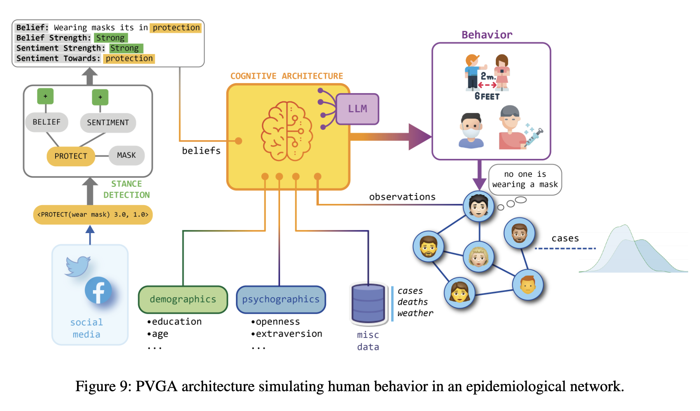
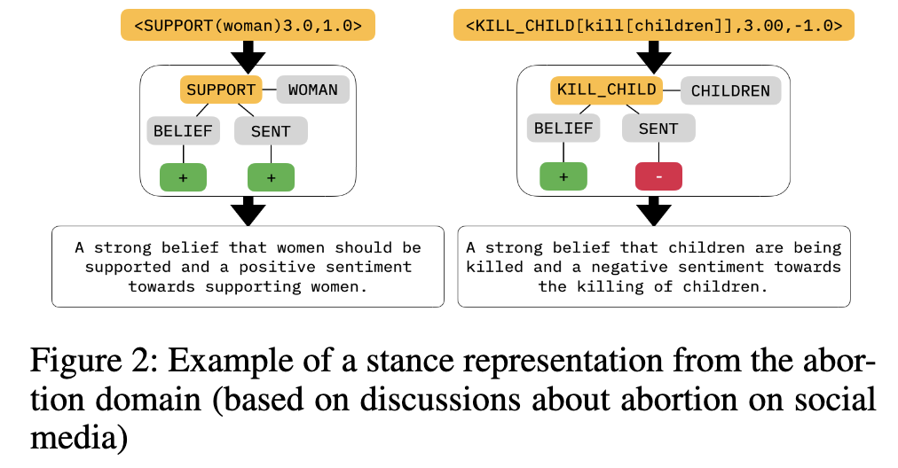
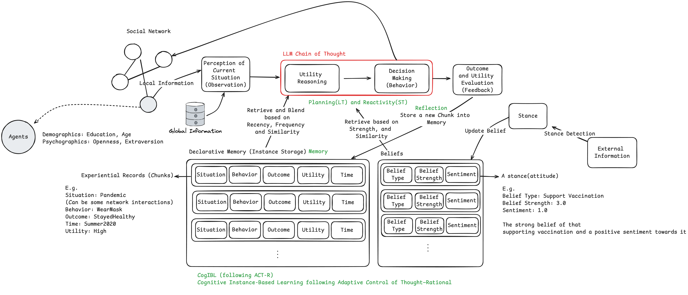

### Psychologically-Valid Generative Agents: A Novel Framework for Advancing Agent-Based Modeling in Social Sciences

The intersection of artificial intelligence and social sciences has long been a fertile ground for innovation, and the recent work titled *Psychologically-Valid Generative Agents: A Novel Approach to Agent-Based Modeling in Social Sciences* represents a significant contribution to this field. This research introduces a new framework for simulating human behavior at population scales with unprecedented psychological realism. 

This post outlines the key advancements presented in this paper and discusses its potential implications for researchers working on Agent-Based Modeling (ABM), cognitive architectures, and social science simulations.

#### A New Paradigm: Psychologically-Valid Generative Agents (PVGAs)

One of the central challenges in agent-based modeling has been the accurate simulation of dynamic, human-like behavior. Traditional ABM approaches often rely on rule-based agents, which lack the flexibility to adapt to real-world complexities and nuanced human decision-making. *Psychologically-Valid Generative Agents (PVGAs)* seek to address this gap by integrating two major components:

- **Cognitive Architecture**: The PVGA framework employs cognitive models, particularly those based on the ACT-R architecture, which simulate human decision-making processes, memory recall, and learning. This architecture provides agents with a theoretically grounded foundation for modeling human cognition and behavior.
  
- **Generative Models**: By incorporating Large Language Models (LLMs), PVGAs can simulate human-like language and interactions. This extends the agents’ capabilities beyond simple decision-making, allowing them to engage in more complex, context-sensitive interactions, making them suitable for exploring communication and behavior patterns in multi-agent environments.

#### Addressing Core Limitations in Agent-Based Modeling

Traditional ABM frameworks, while useful for exploring emergent phenomena in social systems, have often struggled with capturing the adaptive and situated nature of human cognition. Many models assume that agents behave according to fixed rules or static preferences. However, human behavior is highly context-dependent and influenced by factors such as memory, beliefs, and environmental cues.

PVGAs introduce several innovations that directly address these limitations:
- **Instance-Based Learning**: Through the Cognitive Instance-Based Learning (CogIBL) model, agents are capable of adapting to novel situations by referencing similar past experiences stored in memory. This enables them to make decisions that more closely mimic human learning and decision-making over time.
  
- **Dynamic Decision-Making**: PVGAs can dynamically adjust their behaviors based on new data or changing environmental conditions. This adaptive capability is critical for simulating realistic behaviors in rapidly evolving situations, such as pandemic response or natural disaster scenarios.

- **Stance Detection and Personalization**: The use of natural language processing (NLP) techniques, such as Stance Detection, allows PVGAs to be initialized with data-driven personality profiles. These profiles are informed by real-world data, such as social media, which captures beliefs, attitudes, and sentiments. This ensures that agent behaviors are personalized and contextually grounded, improving the realism of the simulations.

#### Applications and Empirical Validation

The authors validate the PVGA framework by applying it to both forecasting and simulation tasks during the COVID-19 pandemic. By modeling agent behaviors such as mask-wearing and social distancing, the PVGAs were able to predict state-level patterns of human mobility and compliance with public health guidelines. These models effectively captured the temporal dynamics of human response to the evolving threat of the pandemic, including the oscillatory patterns of mask adoption and transmission mitigation over multiple waves of the virus.

Moreover, the integration of PVGAs into epidemiological simulations demonstrated their capacity to represent individual and collective behaviors within a networked population of approximately 10,000 agents. The simulations revealed that highly connected agents were more likely to adopt protective behaviors (e.g., wearing masks) as local infection rates increased, thereby reducing the peak of the epidemiological curve.

This dynamic response to environmental cues illustrates the PVGA framework’s potential for advancing simulations in public health, economics, and disaster response. The scalability of the framework, enabled by its cognitive and generative components, further underscores its utility for large-scale social simulations that require high-fidelity behavioral models.

#### Theoretical Contributions and Future Research

The PVGA framework represents a significant advancement in the integration of cognitive architecture and generative models within the domain of Agent-Based Modeling. While LLMs are already being explored in various fields for their ability to generate human-like text, their use in conjunction with cognitive models offers a promising new direction for research. This hybrid approach allows for the modeling of complex decision-making processes, memory-based learning, and real-time adaptation in a way that pure LLMs or cognitive architectures alone cannot achieve.

In addition to the theoretical grounding provided by the ACT-R architecture and Instance-Based Learning Theory, the incorporation of Stance Detection from NLP ensures that PVGAs can simulate personalized, belief-driven behaviors. This is particularly relevant for research into collective decision-making, social dynamics, and the spread of information and misinformation.

Future research could explore several promising directions:
- **Expanding the Cognitive Architecture**: By incorporating additional cognitive mechanisms such as Theory of Mind (ToM), researchers could enhance PVGA’s ability to model more complex social behaviors, including cooperation, competition, and persuasion.
  
- **Cross-Domain Applications**: While the paper focuses on public health and epidemiology, the PVGA framework is applicable to various domains, such as political science, economic modeling, and climate change. Researchers could investigate how the integration of PVGAs could provide insights into other areas where human behavior is central to system dynamics.

- **Validation and Calibration**: Although the paper provides empirical validation in the context of COVID-19, further research is needed to test the robustness of the PVGA framework in different real-world contexts. Additional validation with diverse data sources could enhance the generalizability and accuracy of the models.

#### Conclusion

The introduction of Psychologically-Valid Generative Agents marks a pivotal moment for Agent-Based Modeling and computational social science. By merging the strengths of cognitive architectures and generative models, this framework provides a flexible, adaptive, and realistic approach to simulating human behavior in complex systems. 